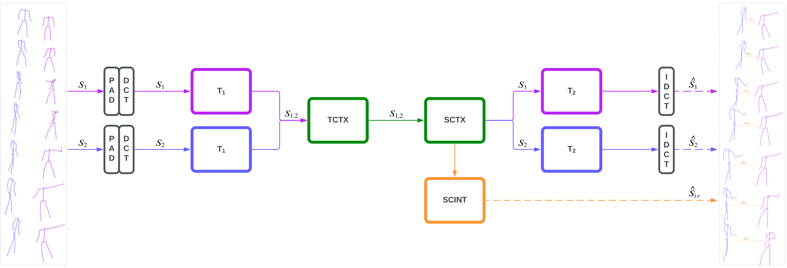

# MPFSIR: An Effective Multi-Person Pose Forecasting Model with Social Interaction Recognition

This is the repository for the paper

> **MPFSIR: An Effective Multi-Person Pose Forecasting Model with Social Interaction Recognition** <br>
> by Romeo Šajina, Marina Ivašić Kos <br>
> [10.1109/ACCESS.2023.3303018](https://ieeexplore.ieee.org/document/10210381) <br>
> **Abstract:**  In recent years, multi-person pose forecasting has gained significant attention due to its potential applications in various fields such as computer vision, robotics, sports analysis, and human-robot interaction. In this paper, we propose a novel deep learning model for multi-person pose forecasting called MPFSIR (multi-person pose forecasting and social interaction recognition) that achieves comparable results with state-of-the-art models, but with up to 30 times fewer parameters. In addition, the model includes a social interaction prediction component to model and predict interactions between individuals. We evaluate our model on three benchmark datasets: 3DPW, CMU-Mocap, and MuPoTS-3D, compare it with state-of-the-art methods, and provide an ablation study to analyze the impact of the different model components. Experimental results show the effectiveness of MPFSIR in accurately predicting future poses and capturing social interactions. Furthermore, we introduce the metric MW-MPJPE to evaluate the performance of pose forecasting, which focuses on motion dynamics. Overall, our results highlight the potential of MPFSIR for predicting the poses of multiple people and understanding social dynamics in complex scenes and in various practical applications, especially where computational resources are limited.




For inquiries, please contact rsajina@unipu.hr


## Getting Started

Clone the repo:

```
git clone https://github.com/RomeoSajina/MPFSIR.git
```

(Optional) Create a Conda environment:
```
conda create -n mpfsir python=3.8
```

Install the requirements using `pip`:
```
pip install -r requirements.txt
```

### Requirements

- torch==1.13.1
- numpy
- scipy
- tqdm
- torchmetrics==0.11.4
- einops==0.6.1
- matplotlib
- open3d==0.16.0
- transforms3d==0.4.1
- trimesh==3.18.1


## Data

First, create a `data/` folder in the repo root directory. We expect the following structure:
```
data/
    3dpw/
        sequenceFiles/
            test/
            train/
            validation/
    somof_data_3dpw/
        3dpw_test_frames_in.json
        3dpw_test_in.json
        ...
    amass/
        BioMotionLab_NTroje/
        BMLmovi/
        CMU/
    cmu_mupots/
        mupots_120_3persons.npy
        test_3_120_mocap.npy
        train_3_120_mocap.npy
```


## Setup and all experiments
Checkout `Run.ipynb` notebook for setup and all experiments, including 3-person dataset from MRT and ablation study


## Training

The model is trained with the training script `train.py`:
```
train.py --device cuda --use_dct --dct_n 30 --use_full_augmentation --use_ctx_loss --out_model_name mpfsir_full
```


## Evaluation
We provide a script to evaluate trained MPFSIR models. You can run
```
eval.py --device cpu --dataset 3dpw --dct_n 30 --out_model_name ./models/mpfsir_full.pt
```
to get these metrics.


### Citing
If you use our code, please cite our work

```
@article{sajina2023mpfsir,
  author={Šajina, Romeo and Ivasic-Kos, Marina},
  journal={IEEE Access},
  title={MPFSIR: An Effective Multi-Person Pose Forecasting Model with Social Interaction Recognition},
  year={2023},
  volume={11},
  number={},
  pages={84822-84833},
  doi={10.1109/ACCESS.2023.3303018}}
```
